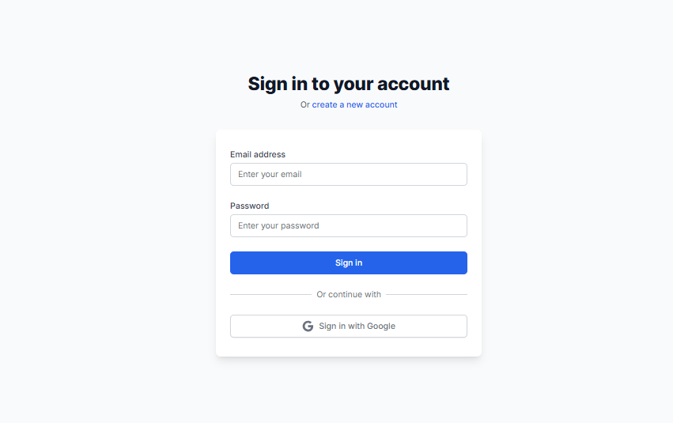
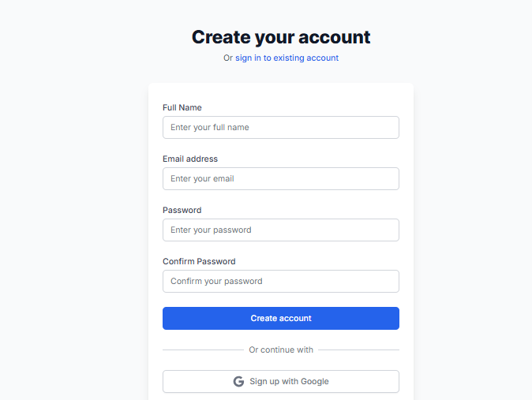
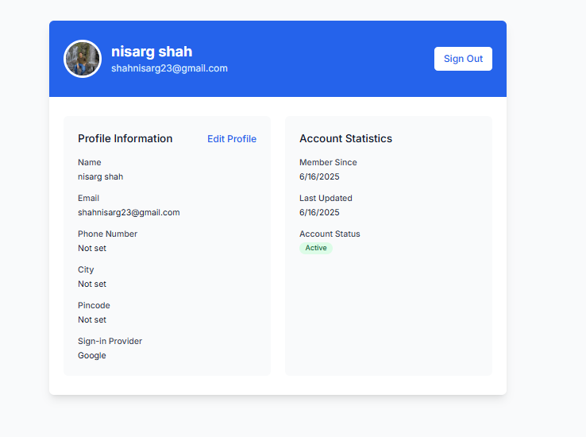
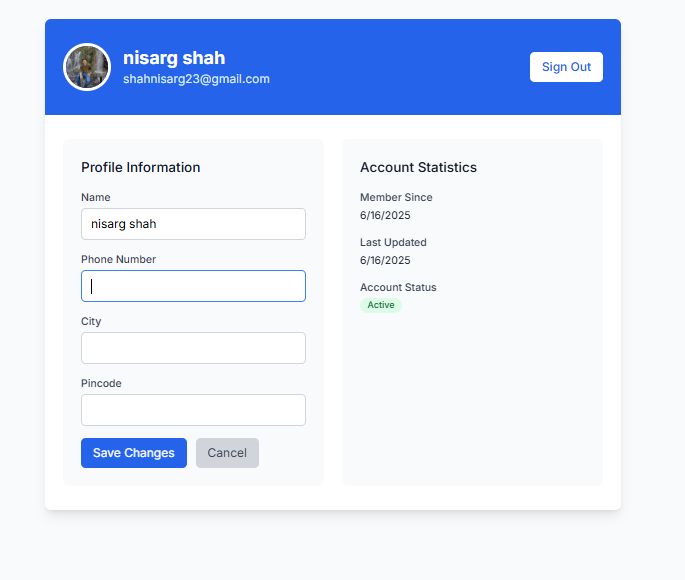

# User Authentication and Profile Management System

A full-stack application that provides user authentication, profile management, and OAuth integration using Google Sign-In.

#ScreenShorts






## Features

- User Authentication
  - Email/Password login
  - Google OAuth Sign-In
  - JWT-based authentication
  - Secure token management

- Profile Management
  - View user profile
  - Update profile information
  - Display user statistics
  - Profile picture support

- Security
  - Protected routes
  - Token-based authentication
  - Secure password handling
  - OAuth integration

## Tech Stack

### Frontend
- React.js
- React Router for navigation
- Context API for state management
- Tailwind CSS for styling
- Firebase for Google OAuth

### Backend
- Node.js
- Express.js
- JWT for authentication
- Crudcrud.com for data storage
- TypeScript

## Project Structure

```
P_labs/
├── Frontend/
│   ├── src/
│   │   ├── components/
│   │   ├── contexts/
│   │   ├── pages/
│   │   └── firebase/
│   └── package.json
└── Backend/
    ├── my-app/
    │   ├── src/
    │   │   ├── routes/
    │   │   ├── services/
    │   │   └── middleware/
    │   └── package.json
```

## Development Timeline

### Phase 1: Initial Setup and Basic Authentication
1. Project structure setup
2. Basic Express server configuration
3. MongoDB integration
4. User model creation
5. Basic authentication routes

### Phase 2: Frontend Development
1. React application setup
2. Authentication context implementation
3. Login and Signup pages
4. Protected route implementation
5. Basic profile page

### Phase 3: OAuth Integration
1. Firebase configuration
2. Google OAuth implementation
3. OAuth token handling
4. User profile synchronization

### Phase 4: Profile Management
1. Profile update functionality
2. User data persistence
3. Profile picture handling
4. User statistics implementation

### Phase 5: Security and Optimization
1. JWT implementation
2. Route protection
3. Error handling
4. Performance optimization

## Getting Started

### Prerequisites
- Node.js (v14 or higher)
- npm or yarn
- Google Cloud Platform account (for OAuth)

### Temoral.io setup
## step 1 - install the docker
-/backEnd/my-app
```bash
cd path/to/companyAssignments
```
## step 2 - clone temporal's docker compose setup using official repo
```bash
 git clone https://github.com/temporalio/docker-compose.git temporal-server
```
# So this will create temporal-server

companyAssignments/ ├── profiletemporal/ ← your app └── temporal-server/ ← Temporal server with Docker Compose

# Step 3: Start Temporal using Docker Compose
Move into the cloned Temporal server directory:
```bash
cd temporal-server
```
Start the Temporal server using Docker Compose:
``` bash
docker-compose up
```


### Installation

1. Clone the repository:
```bash
git clone <repository-url>
cd P_labs
```

2. Install Frontend dependencies:
```bash
cd Frontend
npm install
```

3. Install Backend dependencies:
```bash
cd ../Backend/docker-compose
docker-compose up 
cd ../Backend/my-app
npm install
```

4. Set up environment variables:
   - Create `.env` file in the Backend directory
   - Add the following variables:
     ```
     JWT_SECRET=your_jwt_secret
     GOOGLE_CLIENT_ID=your_google_client_id
     ```

### Running the Application

1. Start the Backend server:
```bash
cd Backend/my-app
npm start
```

2. Start the Frontend development server:
```bash
cd Frontend
npm start
```

The application will be available at:
- Frontend: http://localhost:5173   
- Backend: http://localhost:3000

## Code Execution Flow

### Authentication Flow
1. User enters credentials or clicks Google Sign-In
2. Frontend sends request to backend
3. Backend validates credentials
4. JWT token is generated
5. Token is stored in localStorage
6. User is redirected to profile page

### Profile Update Flow
1. User edits profile information
2. Frontend sends PUT request with token
3. Backend validates token
4. Profile is updated in database
5. Updated profile is returned
6. UI is updated with new information

### OAuth Flow
1. User clicks Google Sign-In
2. Firebase handles OAuth popup
3. Google token is received
4. Token is sent to backend
5. Backend creates/updates user
6. JWT token is generated
7. User is redirected to profile

## API Endpoints

### Authentication
- `POST /api/auth/login` - User login
- `POST /api/auth/signup` - User registration
- `POST /api/auth/google` - Google OAuth login

### Profile
- `GET /api/profile/profile` - Get user profile
- `PUT /api/profile/profile` - Update user profile

## Features in Detail

### Authentication
- Email/Password login with JWT token generation
- Google OAuth integration
- Secure token storage in localStorage
- Protected route implementation

### Profile Management
- View and edit user information
- Update profile details
- Display user statistics
- Profile picture support

### Security Features
- JWT-based authentication
- Protected API endpoints
- Secure password handling
- OAuth integration with Google


## Acknowledgments

- Firebase for OAuth integration
- Crudcrud.com for data storage
- React and Node.js communities for their excellent documentation